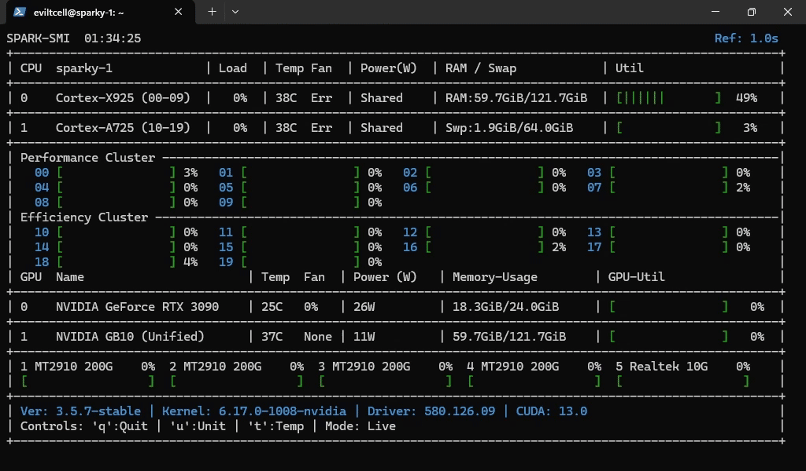
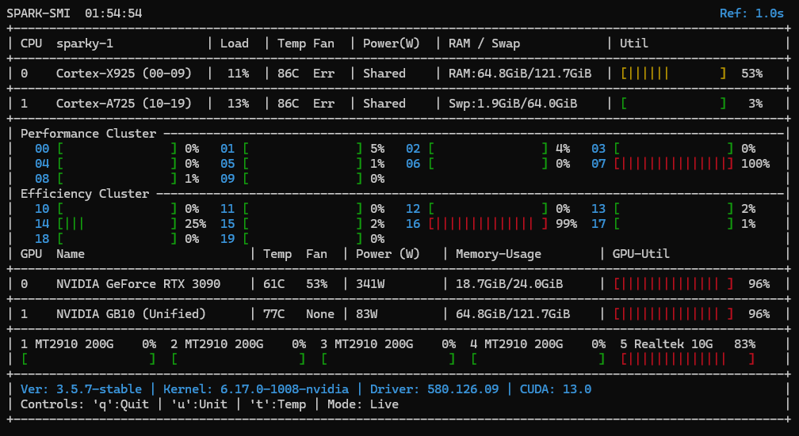

# SPARK-SMI

> A specialized terminal-based system monitor (TUI) built for **NVIDIA Grace Blackwell (GB10)** and hybrid ARM architectures — because `nvidia-smi` alone doesn't tell the full story.


---

## Demo



---

## Why SPARK-SMI?

The NVIDIA DGX Spark (GB10) is a unique system — a Grace Blackwell chip with unified CPU+GPU memory, hybrid Cortex-X925/A725 core clusters, and high-speed MT2910 200G networking. Standard tools like `nvidia-smi`, `htop`, and `nvtop` were not built with this topology in mind. SPARK-SMI was.

| What it handles correctly | Standard tools |
|:---|:---:|
| Hybrid P-core / E-core CPU clusters | ❌ |
| GB10 Unified Memory (CPU+GPU shared) | ❌ |
| MT2910 200G NIC bandwidth monitoring | ❌ |
| Mixed GPU architectures in one system | ❌ |
| NVML with graceful CLI fallback | ✅ |
| Zero system dependencies | ✅ |

---

## Features

- **Snapshot Mode** — Runs once and prints to stdout with full ANSI colors, just like `nvidia-smi`. Pipe it, log it, script it.
- **Live Mode (`-l`)** — Flicker-free TUI that refreshes every second with responsive terminal resize handling.
- **Hybrid CPU Topology** — Correctly splits and labels Cortex-X925 (Performance) and Cortex-A725 (Efficiency) core clusters with individual per-core load bars.
- **Unified Memory Aware** — Detects GB10 unified memory architecture and maps system RAM to GPU memory display accurately.
- **Dual GPU Support** — Handles mixed architectures (e.g. sm_121 GB10 + sm_86 RTX 3090 via OcuLink) simultaneously.
- **NIC Monitoring** — Real-time bandwidth utilization across all interfaces: MT2910 200G ports (1–4) and Realtek 10G (port 5), read directly from sysfs.
- **Driver & CUDA Info** — Footer displays live Driver version and CUDA version via NVML or nvidia-smi fallback.
- **Robust Fallbacks** — NVML → nvidia-smi CLI → graceful degradation. Adapts to missing sensors, fan controllers, and unsupported queries without crashing.

---

## Screenshots

| Full Dashboard | Resize-Safe |
|:---:|:---:|
|  | Scales cleanly from narrow to full-width |

---

## Prerequisites

- Linux (aarch64 recommended — built and tested on DGX Spark)
- Python 3.6+
- NVIDIA Drivers installed
- `nvidia-smi` in PATH

---

## Quick Install

```bash
pip install spark-smi
spark-smi        # snapshot
spark-smi -l     # live mode
```

## Installation

### Option 1: Quick Run (Virtual Environment)
The safest method on DGX appliances — no system libraries touched.

```bash
git clone https://github.com/chappa-ai-llc/spark-smi.git
cd spark-smi
python3 -m venv venv
./venv/bin/pip install -r requirements.txt
```

```bash
# Snapshot (single output)
./venv/bin/python3 spark-smi.py

# Live mode
./venv/bin/python3 spark-smi.py -l
```

### Option 2: System Alias (Recommended)
Type `spark-smi` from anywhere.

```bash
echo "alias spark-smi='~/spark-smi/venv/bin/python3 ~/spark-smi/spark-smi.py'" >> ~/.bashrc
source ~/.bashrc
```

---

## Usage

| Command | Action |
|:---|:---|
| `spark-smi` | Snapshot — print once and exit |
| `spark-smi -l` | Live mode — interactive TUI |
| `spark-smi -n 0.5 -l` | Live mode at 0.5s refresh rate |

**Interactive Controls**

| Key | Action |
|:---:|:---|
| `q` | Quit |
| `t` | Toggle temperature units (°C / °F) |
| `u` | Toggle memory units (GiB / GB) |

---

## Tested Hardware

| Component | Details |
|:---|:---|
| System | NVIDIA DGX Spark |
| SoC | GB10 Grace Blackwell (sm_121) |
| External GPU | RTX 3090 via M.2 OcuLink (sm_86) — mixed architecture, single dashboard |
| NICs | MT2910 × 4 (200G, 100G & 40G DAC), Realtek × 1 (10G, 5G, 2.5G, 1G) |
| OS | Linux 6.17.0-nvidia |
| Driver | 580.126.09 |
| CUDA | 13.0 |

---

## Roadmap

- [ ] **Fan Monitoring** — Read GB10 chassis fan speeds without `sudo` (currently blocked by `nvsm`/IPMI privilege requirements)
- [ ] **REST API / Prometheus Exporter** — Expose a lightweight JSON HTTP endpoint for Grafana and Prometheus integration
- [ ] **CSV Logging Mode** — `--csv` flag to pipe raw metrics to stdout or file for external processing
- [✅] **PyPI Package** — `pip install spark-smi` one-liner install
- [ ] **Multi-node Support** — Monitor clustered DGX Spark nodes from a single dashboard

---

## About

Built by [chappa-ai-llc](https://github.com/chappa-ai-llc) — a solo homelab project born out of frustration with existing tools on novel hardware.

If this saved you time, a ⭐ on the repo is appreciated.

---

## License

MIT — see [LICENSE](LICENSE) for details.
